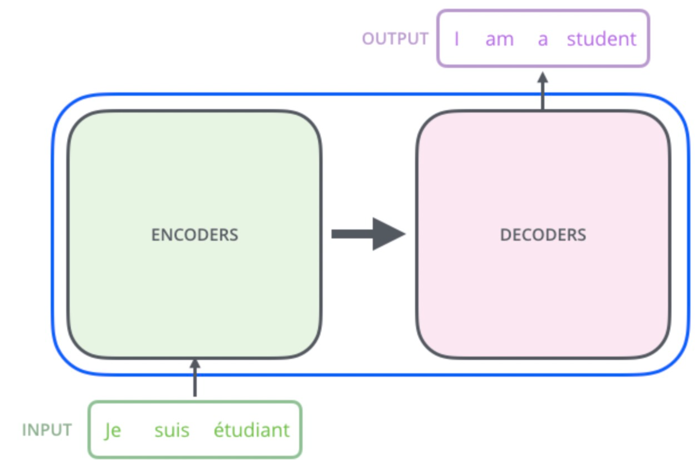
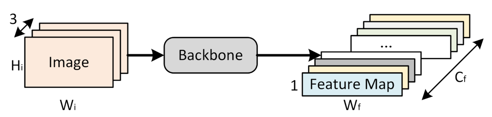
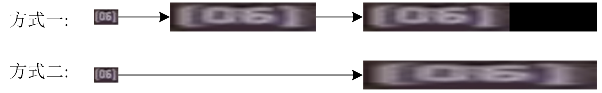
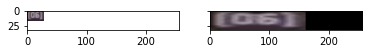
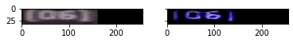
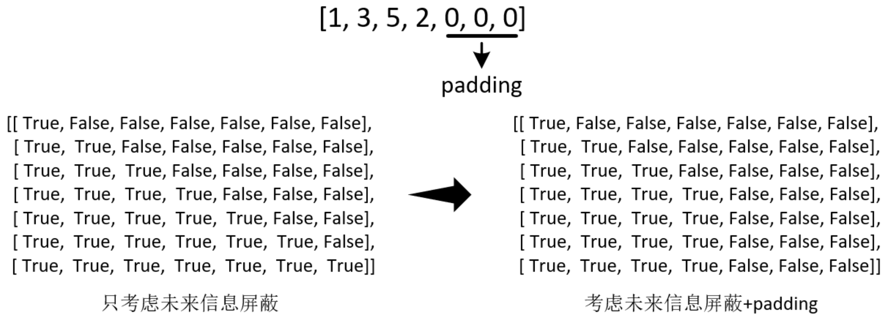
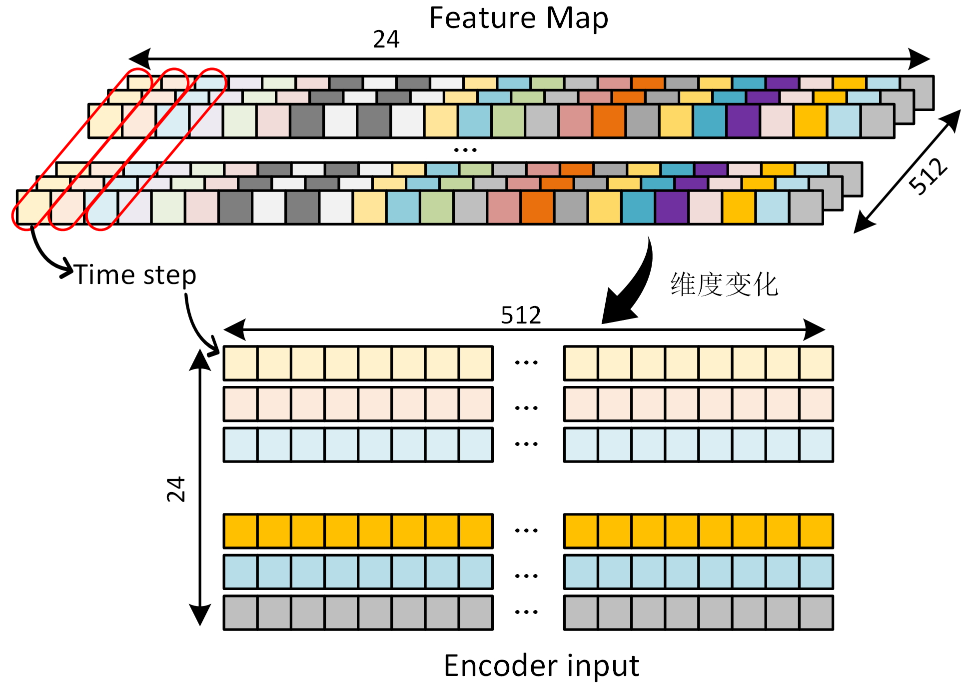

<p align="center">
  <a href="https://github.com/shenhao-stu/Transformer-In-CV">
  	
  </a>
</p>

<p align="center">Python | shenhao0223@163.sufe.edu.cn | 上海财经大学 </p>

<h2 align="center">🐳🐳OCR by transformer🐳🐳</h2>

- **Learner : shenhao**
- **Date : 2021.10.19**

> 实现学号手写数字识别的代码：

本文将以 `ICDAR2015 Incidental Scene Text` 中的 [Task 4.3: Word Recognition](https://rrc.cvc.uab.es/?ch=4&com=downloads) 单词识别子任务作为数据集，讲解如何使用transformer来实现一个简单的OCR文字识别任务，并从中体会transformer是如何应用到除分类以外更复杂的CV任务中的。

**文章将大致从以下几个方面讲解：**

* 数据集简介
* 数据分析与字符映射关系构建
* 如何将transformer引入OCR
* 训练框架代码讲解

**本实验代码主要包括以下几个文件：**

- analysis_recognition_dataset.py (数据集分析脚本)
- ocr_by_transformer.py (OCR任务训练脚本)
- transformer.py (transformer模型文件)
- train_utils.py (训练相关辅助函数，loss、optimizer等)
- ocr_by_transformer_colab.ipynb(OCR任务的notebook笔记)
- ocr_by_transformer_colab.html(HTML网页)

其中 **ocr_by_transformer.py** 为**主要的训练脚本**，其依托 **train_utils.py** 和 **transformer.py** 两个文件构建 transformer 来完成**字符识别模型**的训练。

## 数据集介绍

本文OCR实验使用的数据集基于`ICDAR2015 Incidental Scene Text` 中的 `Task 4.3: Word Recognition`，这是一个单词识别任务，我们去掉了其中一些图片，来简化这个实验的难度，马上会提到。

处理后的数据集下载链接：[百度云盘](https://pan.baidu.com/s/1phOi4Rt023H4cpQS3_IIUQ) ，密码: a5rr

该数据集包含了众多自然场景图像中出现的文字区域，原始数据中训练集含有4468张图像，测试集含有2077张图像，他们都是从原始大图中依据文字区域的bounding box裁剪出来的，图像中的文字基本处于图片中心位置。

|                     word_79.png, "Share"                     |                   word_104.png, "Optical"                    |
| :----------------------------------------------------------: | :----------------------------------------------------------: |
|  |  |

下载后的数据集包含以下几个文件或目录：

- train  
- train_gt.txt  
- valid  
- valid_gt.txt

其中 train 和 valid 两个目录分别存放训练图像和测试图像，对应的标签文件分别为 train.txt 和 valid.txt，形式为 `图片名, "文字标签"`，如下所示：

```
word_1.png, "JOINT"
word_2.png, "yourself"
word_3.png, "154"
word_4.png, "197"
word_5.png, "727"
```

为了简化后续实验的识别难度，提供的数据集使用高宽比>1.5粗略过滤了文字竖向排列的图像，因此与ICDAR2015的原始数据集略有差别。

## 数据分析与字符映射关系构建

开始实验前，我们先对数据进行简单分析，只有对数据的特性足够了解，才能够更好的搭建出baseline，在训练中少走弯路。

运行下面代码，即可一键完成对于数据集的简单分析：

> python analysis_recognition_dataset.py

具体地，这个脚本所做的工作包括：对数据进行标签字符统计(有哪些字符、每个字符出现次数多少)、最长标签长度统计，图像尺寸分析等，并且构建字符标签的映射关系文件 `lbl2id_map.txt`。

下面我们来一点点看代码：

首先完成准备工作，导入需要的库，并设置好相关目录或文件的路径

```python
import os
import cv2

# 数据集根目录，请将数据下载到此位置
base_data_dir = './ICDAR_2015'

# 训练数据集和验证数据集所在路径
train_img_dir = os.path.join(base_data_dir, 'train')
valid_img_dir = os.path.join(base_data_dir, 'valid')
# 训练集和验证集标签文件路径
train_lbl_path = os.path.join(base_data_dir, 'train_gt.txt')
valid_lbl_path = os.path.join(base_data_dir, 'valid_gt.txt')
# 中间文件存储路径，存储标签字符与其id的映射关系
lbl2id_map_path = os.path.join(base_data_dir, 'lbl2id_map.txt')
```

### 1. 标签最长字符个数统计

首先统计数据集最长label中包含的字符数量，此处要将训练集和验证集中的最长标签都进行统计，进而得到最长标签所含字符。

```python
def statistics_max_len_label(lbl_path):
    """
    统计标签文件中最长的label所包含的字符数
    lbl_path: txt标签文件路径
    """
    max_len = -1
    with open(lbl_path, 'r', encoding='utf-8') as reader:
        for line in reader:
            items = line.rstrip().split(',')
            # img_name = items[0]  # 提取图像名称
            lbl_str = items[1].strip()[1:-1]  # 提取标签，并除掉标签中的引号""
            lbl_len = len(lbl_str)
            max_len = max_len if max_len>lbl_len else lbl_len
    return max_len


train_max_label_len = statistics_max_len_label(train_lbl_path)  # 训练集最长label
valid_max_label_len = statistics_max_len_label(valid_lbl_path)  # 验证集最长label
max_label_len = max(train_max_label_len, valid_max_label_len)  # 全数据集最长label
print(f"数据集中包含字符最多的label长度为{max_label_len}")
```

数据集中最长label含有21个字符，这将为后面transformer模型搭建时的时间步长度的设置提供参考。

### 2. 标签所含字符统计

下面代码查看数据集中出现过的所有字符：

```python
def statistics_label_cnt(lbl_path, lbl_cnt_map):
    """
    统计标签文件中label都包含哪些字符以及各自出现的次数
    lbl_path : 标签文件所处路径
    lbl_cnt_map : 记录标签中字符出现次数的字典
    """

    with open(lbl_path, 'r', encoding='utf-8') as reader:
        for line in reader:
            items = line.rstrip().split(',')
            # img_name = items[0]
            lbl_str = items[1].strip()[1:-1]  # 提取标签并去除label中的双引号""
            for lbl in lbl_str:
                if lbl not in lbl_cnt_map.keys():
                    lbl_cnt_map[lbl] = 1
                else:
                    lbl_cnt_map[lbl] += 1


lbl_cnt_map = dict()  # 用于存储字符出现次数的字典
statistics_label_cnt(train_lbl_path, lbl_cnt_map)  # 训练集中字符出现次数统计
print("训练集中label中出现的字符:")
print(lbl_cnt_map)
statistics_label_cnt(valid_lbl_path, lbl_cnt_map)  # 训练集和验证集中字符出现次数统计
print("训练集+验证集label中出现的字符:")
print(lbl_cnt_map)
```

输出结果为： 

``` python
训练集中label中出现的字符:
{'[': 2, '0': 182, '6': 38, ']': 2, '2': 119, '-': 68, '3': 50, 'C': 593, 'a': 843, 'r': 655, 'p': 197, 'k': 96, 'E': 1421, 'X': 110, 'I': 861, 'T': 896, 'R': 836, 'f': 133, 'u': 293, 's': 557, 'i': 651, 'o': 659, 'n': 605, 'l': 408, 'e': 1055, 'v': 123, 'A': 1189, 'U': 319, 'O': 965, 'N': 785, 'c': 318, 't': 563, 'm': 202, 'W': 179, 'H': 391, 'Y': 229, 'P': 389, 'F': 259, 'G': 345, '?': 5, 'S': 1161, 'b': 88, 'h': 299, ' ': 50, 'g': 171, 'L': 745, 'M': 367, 'D': 383, 'd': 257, '$': 46, '5': 77, '4': 44, '.': 95, 'w': 97, 'B': 331, '1': 184, '7': 43, '8': 44, 'V': 158, 'y': 161, 'K': 163, '!': 51, '9': 66, 'z': 12, ';': 3, '#': 16, 'j': 15, "'": 51, 'J': 72, ':': 19, 'x': 27, '%': 28, '/': 24, 'q': 3, 'Q': 19, '(': 6, ')': 5, '\\': 8, '"': 8, 'Â': 3, '´': 3, 'Z': 29, '&': 9, 'Ã': 1, '‰': 1, '@': 4, '=': 1, '+': 1}
训练集+验证集label中出现的字符:
{'[': 2, '0': 232, '6': 44, ']': 2, '2': 139, '-': 87, '3': 69, 'C': 893, 'a': 1200, 'r': 935, 'p': 317, 'k': 137, 'E': 2213, 'X': 181, 'I': 1241, 'T': 1315, 'R': 1262, 'f': 203, 'u': 415, 's': 793, 'i': 924, 'o': 954, 'n': 880, 'l': 555, 'e': 1534, 'v': 169, 'A': 1827, 'U': 467, 'O': 1440, 'N': 1158, 'c': 442, 't': 829, 'm': 278, 'W': 288, 'H': 593, 'Y': 341, 'P': 582, 'F': 402, 'G': 521, '?': 7, 'S': 1748, 'b': 129, 'h': 417, ' ': 82, 'g': 260, 'L': 1120, 'M': 536, 'D': 548, 'd': 367, '$': 57, '5': 100, '4': 53, '.': 132, 'w': 136, 'B': 468, '1': 228, '7': 60, '8': 51, 'V': 224, 'y': 231, 'K': 253, '!': 65, '9': 76, 'z': 14, ';': 3, '#': 24, 'j': 19, "'": 70, 'J': 100, ':': 24, 'x': 38, '%': 42, '/': 29, 'q': 3, 'Q': 28, '(': 7, ')': 5, '\\': 8, '"': 8, 'Â': 3, '´': 3, 'Z': 36, '&': 15, 'Ã': 3, '‰': 2, '@': 9, '=': 1, '+': 2, '©': 1}
```

上方代码中，**lbl_cnt_map** 为字符出现次数的统计字典，后面还会用于建立字符及其id映射关系。

从数据集统计结果来看，测试集含有训练集没有出现过的字符，例如测试集中包含1个'©'未曾在训练集出现。这种情况数量不多，应该问题不大，所以此处未对数据集进行额外处理(但是有意识的进行这种训练集和测试集是否存在diff的检查是必要的)。

### 3. char和id的映射字典构建

在本文OCR任务中，需要对图片中的每个字符进行预测，为了达到这个目的，首先就需要建立一个字符与其id的映射关系，将文本信息转化为可供模型读取的数字信息，这一步类似NLP中建立语料库。

在构建映射关系时，除了记录所有标签文件中出现的字符外，还需要初始化三个特殊字符，分别用来代表一个句子起始符、句子终止符和填充(Padding)标识符。相信经过6.1节的介绍你能够明白这3种特殊字符的作用，后面dataset构建部分的讲解也还会再次提到。

脚本运行后，所有字符的映射关系将会保存在 `lbl2id_map.txt`文件中。

```python
# 构造label中 字符--id 之间的映射
print("构造label中 字符--id 之间的映射:")

lbl2id_map = dict()
# 初始化三个特殊字符
lbl2id_map['☯'] = 0    # padding标识符
lbl2id_map['■'] = 1    # 句子起始符
lbl2id_map['□'] = 2    # 句子结束符
# 生成其余字符的id映射关系
cur_id = 3
for lbl in lbl_cnt_map.keys():
    lbl2id_map[lbl] = cur_id
    cur_id += 1
    
# 保存 字符--id 之间的映射 到txt文件
with open(lbl2id_map_path, 'w', encoding='utf-8') as writer:  # 参数encoding是可选项，部分设备并未默认为utf-8
    for lbl in lbl2id_map.keys():
        cur_id = lbl2id_map[lbl]
        print(lbl, cur_id)
        line = lbl + '\t' + str(cur_id) + '\n'
        writer.write(line)
```

构造出的 字符-id 之间的映射:

```
☯ 0
■ 1
□ 2
[ 3
0 4
...
Z 83
& 84
É 85
@ 86
= 87
+ 88
é 89
```

此外，**analysis_recognition_dataset.py** 文件中还包含一个建立关系映射字典的函数，可以通过读取含有映射关系txt的文件，构建出字符到id和id到字符的映射字典。这服务于后续transformer训练过程，以方便字符关系快速实现转换。

```python
def load_lbl2id_map(lbl2id_map_path):
    """
    读取 字符-id 映射关系记录的txt文件，并返回 lbl->id 和 id->lbl 映射字典
    lbl2id_map_path : 字符-id 映射关系记录的txt文件路径
    """

    lbl2id_map = dict()
    id2lbl_map = dict()
    with open(lbl2id_map_path, 'r', encoding='utf-8') as reader:
        for line in reader:
            items = line.rstrip().split('\t')
            label = items[0]
            cur_id = int(items[1])
            lbl2id_map[label] = cur_id
            id2lbl_map[cur_id] = label
    return lbl2id_map, id2lbl_map
```

### 4. 数据集图像尺寸分析

在进行图像分类检测等任务时，经常会查看图像的尺寸分布，进而确定合适的图像的预处理方式，例如在进行目标检测时会对图像尺寸和bounding box的尺寸进行统计，分析长宽比进而选择合适的图像裁剪策略和适当的初始anchor策略等。

因此这里通过分析图像宽度、高度和宽高比等信息来了解数据的特点，为后续实验策略制定提供参考。

```python
# 分析数据集图片尺寸
print("分析数据集图片尺寸:")

# 初始化参数
min_h = 1e10
min_w = 1e10
max_h = -1
max_w = -1
min_ratio = 1e10
max_ratio = 0
# 遍历数据集计算尺寸信息
for img_name in os.listdir(train_img_dir):
    img_path = os.path.join(train_img_dir, img_name)
    img = cv2.imread(img_path)  # 读取图片
    h, w = img.shape[:2]  # 提取图像高宽信息
    ratio = w / h  # 宽高比
    min_h = min_h if min_h <= h else h  # 最小图片高度
    max_h = max_h if max_h >= h else h  # 最大图片高度
    min_w = min_w if min_w <= w else w  # 最小图片宽度
    max_w = max_w if max_w >= w else w  # 最大图片宽度
    min_ratio = min_ratio if min_ratio <= ratio else ratio  # 最小宽高比
    max_ratio = max_ratio if max_ratio >= ratio else ratio  # 最大宽高比
# 输出信息
print('min_h:', min_h)
print('max_h:', max_h)
print('min_w:', min_w)
print('max_w:', max_w)
print('min_ratio:', min_ratio)
print('max_ratio:', max_ratio)
```

数据集图片尺寸相关情况统计结果如下：

```
min_h: 9
max_h: 295
min_w: 16
max_w: 628
min_ratio: 0.6666666666666666
max_ratio: 8.619047619047619
```

通过以上的结果，可看出图片多为卧倒的长条形，最大宽高比 > 8 可见存在极细长的图片。

以上便是对于数据集的若干简单分析，并且准备出了训练要用的char2id映射文件，下面就是重头戏了，来看看我们如何将transfomer引入，来完成OCR单词识别这样的CV任务。

## 如何将transformer引入OCR

很多算法本身并不难，难的是如何思考和定义问题，把它转化到已知的解决方案上去。因此在看代码之前，我们先要聊聊，为什么transformer可以解决OCR问题，动机是什么？

首先，我们知道，transformer被广泛应用在NLP领域中，可以解决类似机器翻译这样的sequence to sequence类的问题，如下图所示：



而OCR识别任务，如下图所示，我们希望将下图识别为"Share"，本质上也可以看作是一个sequence to sequence任务，只不过输入的序列信息是由图片形式表示的。如下图所示：


通过观察上图可以发现，整个pipeline和利用transformer训练机器翻译的流程是基本一致的，之间的差异主要是多了**借助一个CNN网络作为backbone**提取图像特征得到**input embedding**的过程。

关于构造transformer的输入embedding这部分的设计，是本文的重点，也是整个算法能够work的关键。后文会结合代码，对上面示意图中展示的相关细节进行展开讲解

## 准备工作

### 导入库


```python
import os
import time
import copy
import numpy as np
from PIL import Image
import matplotlib.pyplot as plt

# torch相关包
import torch
import torch.nn as nn
import torchvision.models as models
import torchvision.transforms as transforms

# 导入工具类包
from analysis_recognition_dataset import load_lbl2id_map, statistics_max_len_label
from transformer import *
from train_utils import *
```

### 数据集构造和参数设定

#### set parameters


```python
# TODO set parameters
# 数据集根目录，请将数据下载到此位置
base_data_dir = '../dataset/ICDAR_2015/'
device_name = 'cuda' if torch.cuda.is_available() else 'cpu'
device = torch.device(device_name)
nrof_epochs = 20
batch_size = 64
model_save_path = './log/ex1_ocr_model.pth'
print('Using {} device'.format(device))
```

    Using cuda device


#### The preparatory work for  datasets


```python
# 读取label-id映射关系记录文件
lbl2id_map_path = os.path.join(base_data_dir, 'lbl2id_map.txt')
lbl2id_map, id2lbl_map = load_lbl2id_map(lbl2id_map_path)

# 统计数据集中出现的所有的label中包含字符最多的有多少字符，数据集构造gt信息需要用到
train_lbl_path = os.path.join(base_data_dir, 'train_gt.txt')
valid_lbl_path = os.path.join(base_data_dir, 'valid_gt.txt')
train_max_label_len = statistics_max_len_label(train_lbl_path)  # train_max_label_len = 19
valid_max_label_len = statistics_max_len_label(valid_lbl_path)  # valid_max_label_len = 21

# 数据集中字符数最多的一个case作为制作的gt的sequence_len
sequence_len = max(train_max_label_len, valid_max_label_len) # sequence_len = 21
```

## Dataset构建

### 图片预处理

假设图片尺寸为 $ [batch\_size, 3, H_i, W_i] $

经过网络后的特征图尺寸为 $ [batch\_size, C_f, H_f ,W_f] $

基于之前对于数据集的分析，图片基本都是水平长条状的，图像内容是水平排列的字符组成的单词。那么图片空间上同一纵向切片的位置，基本只有一个字符，因此纵向分辨率不需要很大，那么取 $H_f=1$即可；而横向的分辨率需要大一些，我们需要有不同的embedding来编码水平方向上不同字符的特征。



这里，我们就用最经典的**resnet18**网络作为backbone，由于其**下采样倍数**为**32**，最后一层特征图**channel数**为512，那么:

$ H_i = H_f * 32 = 32 $

$ C_f = 512 $

那么输入图片的宽度如何确定呢？这里给出两种方案，如下图所示：



**方法一：** 设定一个固定尺寸，将图像保持其宽高比进行resize，右侧空余区域进行padding；

**方法二：** 直接将原始图像强制resize到一个预设的固定尺寸。

> **注：这里不妨先思考下，你觉得哪种方案比较好呢？**  
这里作者选择了方法一，因为图片的宽高比和图片中单词的字符数量是大致呈正比的，如果预处理时保持住原图片的宽高比，那么特征图上每一个像素对应原图上字符区域的范围就是基本稳定的，这样或许有更好的预测效果。

这里还有个细节，观察上图你会发现，每个宽：高=1:1的区域内，基本都分布着2-3个字符，因此我们实际操作时也没有严格的保持宽高比不变，而是将宽高比提升了3倍，即先将原始图片宽度拉长到原来的3倍，再保持宽高比，将高resize到32。

> **注：这里建议再次停下来思考下，刚刚这个细节又是为什么？**  
这样做的目的是让图片上每一个字符，都有至少一个特征图上的像素与之对应，而不是特征图宽维度上一个像素同时编码了原图中的多个字符的信息，这样我认为会对transformer的预测带来不必要的困难。

确定了resize方案，$ W_i $ 具体设置为多少呢？结合前面我们对数据集做分析时的两个重要指标，数据集label中最长字符数为21，最长的宽高比8.6，我们将最终的宽高比设置为 24:1，因此汇总一下各个参数的设置：

$ H_i = H_f * 32 = 32 $

$ W_i = 24 * H_i = 768 $

$ C_f = 512, H_f = 1, W_f = 24 $


```python
img_dir = base_data_dir + 'train'
img_path = os.path.join(img_dir, 'word_2.png')
img_path
```


    '../dataset/ICDAR_2015/train/word_2.png'


```python
# load image
img = Image.open(img_path).convert('RGB')
max_ratio =8 
# 对图片进行大致等比例的缩放
# 将高缩放到32，宽大致等比例缩放，但要被32整除
w, h = img.size
ratio = round((w / h) * 3)   # 将宽拉长3倍，然后四舍五入
if ratio == 0:
    ratio = 1 
if ratio > max_ratio:
    ratio = max_ratio
h_new = 32
w_new = h_new * ratio
img_resize = img.resize((w_new, h_new), Image.BILINEAR)

# 对图片右半边进行padding，使得 宽/高 比例固定=self.max_ratio
# Image.new(mode, size, color=0)
img_padd = Image.new('RGB', (32*max_ratio, 32), (0,0,0)) # (0,0,0)为RGB三通道的填充色
img_padd.paste(img_resize, (0, 0))  # 在(0,0)位置起进行paste
```

通过下图可以看到,在变化后的IMAGE中每一个32\*32的区域中都只包括了一个字符,因此特征图上的像素不会同时编码原图中的多个字符的信息.只可能对应于一个字符.


```python
_, [ax1, ax2] = plt.subplots(1, 2, sharex=True, sharey=True)
ax1.imshow(np.array(img))
ax2.imshow(np.array(img_padd))
plt.show()
```



    


### 图像增广

图像增广并不是重点，这里我们除了上述的resize方案外，仅对图像进行常规的随机颜色变换和归一化操作。


```python
# transforms.ColorJitter(brightness=0, contrast=0, saturation=0, hue=0)
# transforms.ColorJitter?
```


```python
# 定义随机颜色变换
color_trans = transforms.ColorJitter(0.1, 0.1, 0.1) # range: 0.9-1.1 for brightness,contrast and saturation
# 定义 Normalize
trans_Normalize = transforms.Compose([
    transforms.ToTensor(),
    transforms.Normalize([0.485, 0.456, 0.406], [0.229, 0.224, 0.225]), # torchvision.transforms.Normalize(mean, std)
])
# 随机颜色变换
img_input_color = color_trans(img_padd)
# Normalize
img_input_norm = trans_Normalize(img_input_color)
```


```python
_, [ax1, ax2] = plt.subplots(1, 2, sharex=True, sharey=True)
ax1.imshow(np.array(img_input_color))
ax2.imshow(np.transpose(img_input_norm, (1, 2, 0)))
plt.show()
```

    Clipping input data to the valid range for imshow with RGB data ([0..1] for floats or [0..255] for integers).



    


### 完整代码


```python
class Recognition_Dataset(object):

    def __init__(self, dataset_root_dir, lbl2id_map, sequence_len, max_ratio, phase='train', pad=0):

        if phase == 'train':
            self.img_dir = os.path.join(dataset_root_dir, 'train')
            self.lbl_path = os.path.join(dataset_root_dir, 'train_gt.txt')
        else:
            self.img_dir = os.path.join(dataset_root_dir, 'valid')
            self.lbl_path = os.path.join(dataset_root_dir, 'valid_gt.txt')
        self.lbl2id_map = lbl2id_map
        self.pad = pad   # padding标识符的id，默认0
        self.sequence_len = sequence_len    # 序列长度
        self.max_ratio = max_ratio * 3      # 将宽拉长3倍

        self.imgs_list = []
        self.lbls_list = []
        with open(self.lbl_path, 'r', encoding='utf-8') as reader:
            for line in reader:
                items = line.rstrip().split(',')
                img_name = items[0]  # img_name = 'word_2.png'
                lbl_str = items[1].strip()[1:-1]  # lbl_str = '[06]'

                self.imgs_list.append(img_name)
                self.lbls_list.append(lbl_str)

        # 定义随机颜色变换
        self.color_trans = transforms.ColorJitter(0.1, 0.1, 0.1)
        # 定义 Normalize
        self.trans_Normalize = transforms.Compose([
            transforms.ToTensor(),
            transforms.Normalize([0.485, 0.456, 0.406], [0.229, 0.224, 0.225]),
        ])

    def __getitem__(self, index):
        """ 
        获取对应index的图像和ground truth label，并视情况进行数据增强
        """
        img_name = self.imgs_list[index]
        img_path = os.path.join(self.img_dir, img_name)
        lbl_str = self.lbls_list[index]

        # ----------------
        # 图片预处理
        # ----------------
        # load image
        img = Image.open(img_path).convert('RGB')

        # 对图片进行大致等比例的缩放
        # 将高缩放到32，宽大致等比例缩放，但要被32整除
        w, h = img.size
        ratio = round((w / h) * 3)   # 将宽拉长3倍，然后四舍五入
        if ratio == 0:
            ratio = 1
        if ratio > self.max_ratio:
            ratio = self.max_ratio
        h_new = 32
        w_new = h_new * ratio
        img_resize = img.resize((w_new, h_new), Image.BILINEAR)

        # 对图片右半边进行padding，使得宽/高比例固定=self.max_ratio
        img_padd = Image.new('RGB', (32*self.max_ratio, 32), (0, 0, 0))
        img_padd.paste(img_resize, (0, 0))

        # 随机颜色变换
        img_input = self.color_trans(img_padd)
        # Normalize
        img_input = self.trans_Normalize(img_input)

        # ----------------
        # label处理
        # ----------------

        # 构造encoder的mask
        encode_mask = [1] * ratio + [0] * (self.max_ratio - ratio)
        encode_mask = torch.tensor(encode_mask)
        encode_mask = (encode_mask != 0).unsqueeze(0)

        # 构造ground truth label
        gt = []
        gt.append(1)    # 先添加句子起始符
        for lbl in lbl_str:
            gt.append(self.lbl2id_map[lbl])
        gt.append(2)
        # 除去起始符终止符，lbl长度为sequence_len，剩下的padding
        for i in range(len(lbl_str), self.sequence_len):
            gt.append(0)
        # 截断为预设的最大序列长度
        gt = gt[:self.sequence_len]

        # decoder的输入
        decode_in = gt[:-1]
        decode_in = torch.tensor(decode_in)
        # decoder的输出
        decode_out = gt[1:]
        decode_out = torch.tensor(decode_out)
        # decoder的mask
        decode_mask = self.make_std_mask(decode_in, self.pad)
        # 有效tokens数
        ntokens = (decode_out != self.pad).data.sum()

        return img_input, encode_mask, decode_in, decode_out, decode_mask, ntokens

    @staticmethod
    def make_std_mask(tgt, pad):
        """
        Create a mask to hide padding and future words.
        padd 和 future words 均在mask中用0表示
        """
        tgt_mask = (tgt != pad)
        tgt_mask = tgt_mask & subsequent_mask(
            tgt.size(-1)).type_as(tgt_mask.data)
        tgt_mask = tgt_mask.squeeze(0)   # subsequent返回值的shape是(1, N, N)
        return tgt_mask

    def __len__(self):
        return len(self.imgs_list)
```

上面的代码中还设计到几个和label处理相关的细节，属于Transformer训练相关的逻辑，之前的章节已经介绍过，这里再简单提一下：

**encode_mask**

由于我们对图像进行了尺寸调整，并根据需求对图像进行了padding，而padding的位置是没有包含有效信息的，为此需要根据padding比例构造相应encode_mask，让transformer在计算时忽略这部分无意义的区域。

**label处理**

本实验使用的预测标签与机器翻译模型训练时的标签基本一致，因此在处理方式中差异较小。

标签处理中，将label中字符转换成其对应id，并在句子开始添加起始符，句子最后添加终止符，并在不满足sequence_len长度时在剩余位置进行padding（0补位）。

**decode_mask**

一般的在decoder中我们会根据label的sequence_len生成一个上三角阵形式的mask，mask的每一行便可以控制当前time_step时，只允许decoder获取当前步时之前的字符信息，而禁止获取未来时刻的字符信息，这防止了模型训练时的作弊行为。

decode_mask经过一个特殊的函数 **make_std_mask()** 进行生成。

同时，decoder的label制作同样要考虑上对padding的部分进行mask，所以decode_mask在label被padding对应的位置处也应该进行写成False。

生成的decode_mask如下图所示：


以上是构建Dataset的所有细节，进而我们可以构建出DataLoader供训练使用

### DataLoader构建


```python
# 构造 dataloader
max_ratio = 8    # 图片预处理时 宽/高 的最大值，不超过就保比例resize，超过会强行压缩
train_dataset = Recognition_Dataset(
    base_data_dir, lbl2id_map, sequence_len, max_ratio, 'train', pad=0)
valid_dataset = Recognition_Dataset(
    base_data_dir, lbl2id_map, sequence_len, max_ratio, 'valid', pad=0)
# loader size info:
# --> img_input: [batch_size, c, h, w] --> [64, 3, 32, 32*8*3]
# --> encode_mask: [batch_size, h/32, w/32] --> [64, 1, 24] 本文backbone采用的32倍下采样，所以除以32
# --> decode_in: [batch_size, sequence_len-1] --> [64, 20]
# --> decode_out: [batch_size, sequence_len-1] --> [64, 20]
# --> decode_mask: [batch_size, sequence_len-1, sequence_len-1] --> [64, 20, 20]
# --> ntokens: [batch_size] --> [64]
train_loader = torch.utils.data.DataLoader(train_dataset,
                                           batch_size=batch_size,
                                           shuffle=True,
                                           num_workers=2)
valid_loader = torch.utils.data.DataLoader(valid_dataset,
                                           batch_size=batch_size,
                                           shuffle=False,
                                           num_workers=2)
```

## 模型构建

代码通过 **make_ocr_model** 和 **OCR_EncoderDecoder** 类完成模型结构搭建。

可以从 **make_ocr_model** 这个函数看起，该函数首先调用了pytorch中预训练的Resnet-18作为backbone以提取图像特征，此处也可以根据自己需要调整为其他的网络，但需要重点关注的是网络的下采样倍数，以及最后一层特征图的channel_num，相关模块的参数需要同步调整。之后调用了 **OCR_EncoderDecoder** 类完成transformer的搭建。最后对模型参数进行初始化。

在 **OCR_EncoderDecoder** 类中，该类相当于是一个transformer各基础组件的拼装线，包括 encoder 和 decoder 等，其初始参数是已存在的基本组件，其基本组件代码都在transformer.py文件中，本文将不在过多叙述。

这里再来回顾一下，图片经过backbone后，如何构造为Transformer的输入：

图片经过backbone后将输出一个维度为 **[batch_size, 512, 1, 24]** 的特征图，在不关注batch_size的前提下，每一张图像都会得到如下所示具有512个通道的1×24的特征图，如图中红色框标注所示，将不同通道相同位置的特征值拼接组成一个新的向量，并作为一个时间步的输入，此时变构造出了维度为 **[batch_size, 24, 512]** 的输入，满足Transformer的输入要求。


下面来看下完整的构造模型部分的代码：


```python
# 模型结构
class OCR_EncoderDecoder(nn.Module):
    """
    A standard Encoder-Decoder architecture.
    Base for this and many other models.
    """

    def __init__(self, encoder, decoder, src_embed, src_position, tgt_embed, generator):
        super(OCR_EncoderDecoder, self).__init__()
        self.encoder = encoder
        self.decoder = decoder
        self.src_embed = src_embed    # input embedding module
        self.src_position = src_position
        self.tgt_embed = tgt_embed    # ouput embedding module
        self.generator = generator    # output generation module

    def forward(self, src, tgt, src_mask, tgt_mask):
        "Take in and process masked src and target sequences."
        # src --> [bs, 3, 32, 768]  [bs, c, h, w]
        # src_mask --> [bs, 1, 24]  [bs, h/32, w/32]
        memory = self.encode(src, src_mask)
        # memory --> [bs, 24, 512]
        # tgt --> decode_in [bs, 20]  [bs, sequence_len-1]
        # tgt_mask --> decode_mask [bs, 20]  [bs, sequence_len-1]
        res = self.decode(memory, src_mask, tgt, tgt_mask)  # [bs, 20, 512]
        return res

    def encode(self, src, src_mask):
        # feature extract
        # src --> [bs, 3, 32, 768]
        src_embedds = self.src_embed(src)
        # 此处使用的resnet18作为backbone 输出-->[batchsize, c, h, w] --> [bs, 512, 1, 24]
        # 将src_embedds由shape(bs, model_dim, 1, max_ratio) 处理为transformer期望的输入shape(bs, 时间步, model_dim)
        # [bs, 512, 1, 24] --> [bs, 24, 512]
        src_embedds = src_embedds.squeeze(-2)
        src_embedds = src_embedds.permute(0, 2, 1)

        # position encode
        src_embedds = self.src_position(src_embedds)  # [bs, 24, 512]

        return self.encoder(src_embedds, src_mask)  # [bs, 24, 512]

    def decode(self, memory, src_mask, tgt, tgt_mask):
        target_embedds = self.tgt_embed(tgt)  # [bs, 20, 512]
        return self.decoder(target_embedds, memory, src_mask, tgt_mask)


def make_ocr_model(tgt_vocab, N=6, d_model=512, d_ff=2048, h=8, dropout=0.1):
    """
    构建模型
    params:
        tgt_vocab: 输出的词典大小
        N: 编码器和解码器堆叠基础模块的个数
        d_model: 模型中embedding的size，默认512
        d_ff: FeedForward Layer层中embedding的size，默认2048
        h: MultiHeadAttention中多头的个数，必须被d_model整除
        dropout: dropout的比率
    """
    c = copy.deepcopy

    # torch中预训练的resnet18作为特征提取网络, backbone
    backbone = models.resnet18(pretrained=True)
    # 去掉最后两个层 (global average pooling and fc layer)
    backbone = nn.Sequential(*list(backbone.children())[:-2])

    attn = MultiHeadedAttention(h, d_model)
    ff = PositionwiseFeedForward(d_model, d_ff, dropout)
    position = PositionalEncoding(d_model, dropout)
    # 构建模型
    model = OCR_EncoderDecoder(
        Encoder(EncoderLayer(d_model, c(attn), c(ff), dropout), N),
        Decoder(DecoderLayer(d_model, c(attn), c(attn), c(ff), dropout), N),
        backbone,
        c(position),
        nn.Sequential(Embeddings(d_model, tgt_vocab), c(position)),
        Generator(d_model, tgt_vocab))  # 此处的generator并没有在类内调用

    # Initialize parameters with Glorot / fan_avg.
    for child in model.children():
        if child is backbone:
            # 将backbone的权重设为不计算梯度
            for param in child.parameters():
                param.requires_grad = False
            # 预训练好的backbone不进行随机初始化，其余模块进行随机初始化
            continue
        for p in child.parameters():
            if p.dim() > 1:
                nn.init.xavier_uniform_(p)
    return model
```

通过上述的两个类，可以方便构建transformer模型：


```python
# build model
# use transformer as ocr recognize model
# 此处构建的ocr_model不含有Generator
tgt_vocab = len(lbl2id_map.keys()) 
d_model = 512
ocr_model = make_ocr_model(tgt_vocab, N=5, d_model=d_model, d_ff=2048, h=8, dropout=0.1)
ocr_model.to(device)
```


    OCR_EncoderDecoder(
      (encoder): Encoder(
        (layers): ModuleList(
          (0): EncoderLayer(
            (self_attn): MultiHeadedAttention(
              (linears): ModuleList(
                (0): Linear(in_features=512, out_features=512, bias=True)
                (1): Linear(in_features=512, out_features=512, bias=True)
                (2): Linear(in_features=512, out_features=512, bias=True)
                (3): Linear(in_features=512, out_features=512, bias=True)
              )
              (dropout): Dropout(p=0.1, inplace=False)
            )
            (feed_forward): PositionwiseFeedForward(
              (w_1): Linear(in_features=512, out_features=2048, bias=True)
              (w_2): Linear(in_features=2048, out_features=512, bias=True)
              (dropout): Dropout(p=0.1, inplace=False)
            )
            (sublayer): ModuleList(
              (0): SublayerConnection(
                (norm): LayerNorm()
                (dropout): Dropout(p=0.1, inplace=False)
              )
              (1): SublayerConnection(
                (norm): LayerNorm()
                (dropout): Dropout(p=0.1, inplace=False)
              )
            )
          )
          (1): EncoderLayer(
            (self_attn): MultiHeadedAttention(
              (linears): ModuleList(
                (0): Linear(in_features=512, out_features=512, bias=True)
                (1): Linear(in_features=512, out_features=512, bias=True)
                (2): Linear(in_features=512, out_features=512, bias=True)
                (3): Linear(in_features=512, out_features=512, bias=True)
              )
              (dropout): Dropout(p=0.1, inplace=False)
            )
            (feed_forward): PositionwiseFeedForward(
              (w_1): Linear(in_features=512, out_features=2048, bias=True)
              (w_2): Linear(in_features=2048, out_features=512, bias=True)
              (dropout): Dropout(p=0.1, inplace=False)
            )
            (sublayer): ModuleList(
              (0): SublayerConnection(
                (norm): LayerNorm()
                (dropout): Dropout(p=0.1, inplace=False)
              )
              (1): SublayerConnection(
                (norm): LayerNorm()
                (dropout): Dropout(p=0.1, inplace=False)
              )
            )
          )
          (2): EncoderLayer(
            (self_attn): MultiHeadedAttention(
              (linears): ModuleList(
                (0): Linear(in_features=512, out_features=512, bias=True)
                (1): Linear(in_features=512, out_features=512, bias=True)
                (2): Linear(in_features=512, out_features=512, bias=True)
                (3): Linear(in_features=512, out_features=512, bias=True)
              )
              (dropout): Dropout(p=0.1, inplace=False)
            )
            (feed_forward): PositionwiseFeedForward(
              (w_1): Linear(in_features=512, out_features=2048, bias=True)
              (w_2): Linear(in_features=2048, out_features=512, bias=True)
              (dropout): Dropout(p=0.1, inplace=False)
            )
            (sublayer): ModuleList(
              (0): SublayerConnection(
                (norm): LayerNorm()
                (dropout): Dropout(p=0.1, inplace=False)
              )
              (1): SublayerConnection(
                (norm): LayerNorm()
                (dropout): Dropout(p=0.1, inplace=False)
              )
            )
          )
          (3): EncoderLayer(
            (self_attn): MultiHeadedAttention(
              (linears): ModuleList(
                (0): Linear(in_features=512, out_features=512, bias=True)
                (1): Linear(in_features=512, out_features=512, bias=True)
                (2): Linear(in_features=512, out_features=512, bias=True)
                (3): Linear(in_features=512, out_features=512, bias=True)
              )
              (dropout): Dropout(p=0.1, inplace=False)
            )
            (feed_forward): PositionwiseFeedForward(
              (w_1): Linear(in_features=512, out_features=2048, bias=True)
              (w_2): Linear(in_features=2048, out_features=512, bias=True)
              (dropout): Dropout(p=0.1, inplace=False)
            )
            (sublayer): ModuleList(
              (0): SublayerConnection(
                (norm): LayerNorm()
                (dropout): Dropout(p=0.1, inplace=False)
              )
              (1): SublayerConnection(
                (norm): LayerNorm()
                (dropout): Dropout(p=0.1, inplace=False)
              )
            )
          )
          (4): EncoderLayer(
            (self_attn): MultiHeadedAttention(
              (linears): ModuleList(
                (0): Linear(in_features=512, out_features=512, bias=True)
                (1): Linear(in_features=512, out_features=512, bias=True)
                (2): Linear(in_features=512, out_features=512, bias=True)
                (3): Linear(in_features=512, out_features=512, bias=True)
              )
              (dropout): Dropout(p=0.1, inplace=False)
            )
            (feed_forward): PositionwiseFeedForward(
              (w_1): Linear(in_features=512, out_features=2048, bias=True)
              (w_2): Linear(in_features=2048, out_features=512, bias=True)
              (dropout): Dropout(p=0.1, inplace=False)
            )
            (sublayer): ModuleList(
              (0): SublayerConnection(
                (norm): LayerNorm()
                (dropout): Dropout(p=0.1, inplace=False)
              )
              (1): SublayerConnection(
                (norm): LayerNorm()
                (dropout): Dropout(p=0.1, inplace=False)
              )
            )
          )
        )
        (norm): LayerNorm()
      )
      (decoder): Decoder(
        (layers): ModuleList(
          (0): DecoderLayer(
            (self_attn): MultiHeadedAttention(
              (linears): ModuleList(
                (0): Linear(in_features=512, out_features=512, bias=True)
                (1): Linear(in_features=512, out_features=512, bias=True)
                (2): Linear(in_features=512, out_features=512, bias=True)
                (3): Linear(in_features=512, out_features=512, bias=True)
              )
              (dropout): Dropout(p=0.1, inplace=False)
            )
            (src_attn): MultiHeadedAttention(
              (linears): ModuleList(
                (0): Linear(in_features=512, out_features=512, bias=True)
                (1): Linear(in_features=512, out_features=512, bias=True)
                (2): Linear(in_features=512, out_features=512, bias=True)
                (3): Linear(in_features=512, out_features=512, bias=True)
              )
              (dropout): Dropout(p=0.1, inplace=False)
            )
            (feed_forward): PositionwiseFeedForward(
              (w_1): Linear(in_features=512, out_features=2048, bias=True)
              (w_2): Linear(in_features=2048, out_features=512, bias=True)
              (dropout): Dropout(p=0.1, inplace=False)
            )
            (sublayer): ModuleList(
              (0): SublayerConnection(
                (norm): LayerNorm()
                (dropout): Dropout(p=0.1, inplace=False)
              )
              (1): SublayerConnection(
                (norm): LayerNorm()
                (dropout): Dropout(p=0.1, inplace=False)
              )
              (2): SublayerConnection(
                (norm): LayerNorm()
                (dropout): Dropout(p=0.1, inplace=False)
              )
            )
          )
          (1): DecoderLayer(
            (self_attn): MultiHeadedAttention(
              (linears): ModuleList(
                (0): Linear(in_features=512, out_features=512, bias=True)
                (1): Linear(in_features=512, out_features=512, bias=True)
                (2): Linear(in_features=512, out_features=512, bias=True)
                (3): Linear(in_features=512, out_features=512, bias=True)
              )
              (dropout): Dropout(p=0.1, inplace=False)
            )
            (src_attn): MultiHeadedAttention(
              (linears): ModuleList(
                (0): Linear(in_features=512, out_features=512, bias=True)
                (1): Linear(in_features=512, out_features=512, bias=True)
                (2): Linear(in_features=512, out_features=512, bias=True)
                (3): Linear(in_features=512, out_features=512, bias=True)
              )
              (dropout): Dropout(p=0.1, inplace=False)
            )
            (feed_forward): PositionwiseFeedForward(
              (w_1): Linear(in_features=512, out_features=2048, bias=True)
              (w_2): Linear(in_features=2048, out_features=512, bias=True)
              (dropout): Dropout(p=0.1, inplace=False)
            )
            (sublayer): ModuleList(
              (0): SublayerConnection(
                (norm): LayerNorm()
                (dropout): Dropout(p=0.1, inplace=False)
              )
              (1): SublayerConnection(
                (norm): LayerNorm()
                (dropout): Dropout(p=0.1, inplace=False)
              )
              (2): SublayerConnection(
                (norm): LayerNorm()
                (dropout): Dropout(p=0.1, inplace=False)
              )
            )
          )
          (2): DecoderLayer(
            (self_attn): MultiHeadedAttention(
              (linears): ModuleList(
                (0): Linear(in_features=512, out_features=512, bias=True)
                (1): Linear(in_features=512, out_features=512, bias=True)
                (2): Linear(in_features=512, out_features=512, bias=True)
                (3): Linear(in_features=512, out_features=512, bias=True)
              )
              (dropout): Dropout(p=0.1, inplace=False)
            )
            (src_attn): MultiHeadedAttention(
              (linears): ModuleList(
                (0): Linear(in_features=512, out_features=512, bias=True)
                (1): Linear(in_features=512, out_features=512, bias=True)
                (2): Linear(in_features=512, out_features=512, bias=True)
                (3): Linear(in_features=512, out_features=512, bias=True)
              )
              (dropout): Dropout(p=0.1, inplace=False)
            )
            (feed_forward): PositionwiseFeedForward(
              (w_1): Linear(in_features=512, out_features=2048, bias=True)
              (w_2): Linear(in_features=2048, out_features=512, bias=True)
              (dropout): Dropout(p=0.1, inplace=False)
            )
            (sublayer): ModuleList(
              (0): SublayerConnection(
                (norm): LayerNorm()
                (dropout): Dropout(p=0.1, inplace=False)
              )
              (1): SublayerConnection(
                (norm): LayerNorm()
                (dropout): Dropout(p=0.1, inplace=False)
              )
              (2): SublayerConnection(
                (norm): LayerNorm()
                (dropout): Dropout(p=0.1, inplace=False)
              )
            )
          )
          (3): DecoderLayer(
            (self_attn): MultiHeadedAttention(
              (linears): ModuleList(
                (0): Linear(in_features=512, out_features=512, bias=True)
                (1): Linear(in_features=512, out_features=512, bias=True)
                (2): Linear(in_features=512, out_features=512, bias=True)
                (3): Linear(in_features=512, out_features=512, bias=True)
              )
              (dropout): Dropout(p=0.1, inplace=False)
            )
            (src_attn): MultiHeadedAttention(
              (linears): ModuleList(
                (0): Linear(in_features=512, out_features=512, bias=True)
                (1): Linear(in_features=512, out_features=512, bias=True)
                (2): Linear(in_features=512, out_features=512, bias=True)
                (3): Linear(in_features=512, out_features=512, bias=True)
              )
              (dropout): Dropout(p=0.1, inplace=False)
            )
            (feed_forward): PositionwiseFeedForward(
              (w_1): Linear(in_features=512, out_features=2048, bias=True)
              (w_2): Linear(in_features=2048, out_features=512, bias=True)
              (dropout): Dropout(p=0.1, inplace=False)
            )
            (sublayer): ModuleList(
              (0): SublayerConnection(
                (norm): LayerNorm()
                (dropout): Dropout(p=0.1, inplace=False)
              )
              (1): SublayerConnection(
                (norm): LayerNorm()
                (dropout): Dropout(p=0.1, inplace=False)
              )
              (2): SublayerConnection(
                (norm): LayerNorm()
                (dropout): Dropout(p=0.1, inplace=False)
              )
            )
          )
          (4): DecoderLayer(
            (self_attn): MultiHeadedAttention(
              (linears): ModuleList(
                (0): Linear(in_features=512, out_features=512, bias=True)
                (1): Linear(in_features=512, out_features=512, bias=True)
                (2): Linear(in_features=512, out_features=512, bias=True)
                (3): Linear(in_features=512, out_features=512, bias=True)
              )
              (dropout): Dropout(p=0.1, inplace=False)
            )
            (src_attn): MultiHeadedAttention(
              (linears): ModuleList(
                (0): Linear(in_features=512, out_features=512, bias=True)
                (1): Linear(in_features=512, out_features=512, bias=True)
                (2): Linear(in_features=512, out_features=512, bias=True)
                (3): Linear(in_features=512, out_features=512, bias=True)
              )
              (dropout): Dropout(p=0.1, inplace=False)
            )
            (feed_forward): PositionwiseFeedForward(
              (w_1): Linear(in_features=512, out_features=2048, bias=True)
              (w_2): Linear(in_features=2048, out_features=512, bias=True)
              (dropout): Dropout(p=0.1, inplace=False)
            )
            (sublayer): ModuleList(
              (0): SublayerConnection(
                (norm): LayerNorm()
                (dropout): Dropout(p=0.1, inplace=False)
              )
              (1): SublayerConnection(
                (norm): LayerNorm()
                (dropout): Dropout(p=0.1, inplace=False)
              )
              (2): SublayerConnection(
                (norm): LayerNorm()
                (dropout): Dropout(p=0.1, inplace=False)
              )
            )
          )
        )
        (norm): LayerNorm()
      )
      (src_embed): Sequential(
        (0): Conv2d(3, 64, kernel_size=(7, 7), stride=(2, 2), padding=(3, 3), bias=False)
        (1): BatchNorm2d(64, eps=1e-05, momentum=0.1, affine=True, track_running_stats=True)
        (2): ReLU(inplace=True)
        (3): MaxPool2d(kernel_size=3, stride=2, padding=1, dilation=1, ceil_mode=False)
        (4): Sequential(
          (0): BasicBlock(
            (conv1): Conv2d(64, 64, kernel_size=(3, 3), stride=(1, 1), padding=(1, 1), bias=False)
            (bn1): BatchNorm2d(64, eps=1e-05, momentum=0.1, affine=True, track_running_stats=True)
            (relu): ReLU(inplace=True)
            (conv2): Conv2d(64, 64, kernel_size=(3, 3), stride=(1, 1), padding=(1, 1), bias=False)
            (bn2): BatchNorm2d(64, eps=1e-05, momentum=0.1, affine=True, track_running_stats=True)
          )
          (1): BasicBlock(
            (conv1): Conv2d(64, 64, kernel_size=(3, 3), stride=(1, 1), padding=(1, 1), bias=False)
            (bn1): BatchNorm2d(64, eps=1e-05, momentum=0.1, affine=True, track_running_stats=True)
            (relu): ReLU(inplace=True)
            (conv2): Conv2d(64, 64, kernel_size=(3, 3), stride=(1, 1), padding=(1, 1), bias=False)
            (bn2): BatchNorm2d(64, eps=1e-05, momentum=0.1, affine=True, track_running_stats=True)
          )
        )
        (5): Sequential(
          (0): BasicBlock(
            (conv1): Conv2d(64, 128, kernel_size=(3, 3), stride=(2, 2), padding=(1, 1), bias=False)
            (bn1): BatchNorm2d(128, eps=1e-05, momentum=0.1, affine=True, track_running_stats=True)
            (relu): ReLU(inplace=True)
            (conv2): Conv2d(128, 128, kernel_size=(3, 3), stride=(1, 1), padding=(1, 1), bias=False)
            (bn2): BatchNorm2d(128, eps=1e-05, momentum=0.1, affine=True, track_running_stats=True)
            (downsample): Sequential(
              (0): Conv2d(64, 128, kernel_size=(1, 1), stride=(2, 2), bias=False)
              (1): BatchNorm2d(128, eps=1e-05, momentum=0.1, affine=True, track_running_stats=True)
            )
          )
          (1): BasicBlock(
            (conv1): Conv2d(128, 128, kernel_size=(3, 3), stride=(1, 1), padding=(1, 1), bias=False)
            (bn1): BatchNorm2d(128, eps=1e-05, momentum=0.1, affine=True, track_running_stats=True)
            (relu): ReLU(inplace=True)
            (conv2): Conv2d(128, 128, kernel_size=(3, 3), stride=(1, 1), padding=(1, 1), bias=False)
            (bn2): BatchNorm2d(128, eps=1e-05, momentum=0.1, affine=True, track_running_stats=True)
          )
        )
        (6): Sequential(
          (0): BasicBlock(
            (conv1): Conv2d(128, 256, kernel_size=(3, 3), stride=(2, 2), padding=(1, 1), bias=False)
            (bn1): BatchNorm2d(256, eps=1e-05, momentum=0.1, affine=True, track_running_stats=True)
            (relu): ReLU(inplace=True)
            (conv2): Conv2d(256, 256, kernel_size=(3, 3), stride=(1, 1), padding=(1, 1), bias=False)
            (bn2): BatchNorm2d(256, eps=1e-05, momentum=0.1, affine=True, track_running_stats=True)
            (downsample): Sequential(
              (0): Conv2d(128, 256, kernel_size=(1, 1), stride=(2, 2), bias=False)
              (1): BatchNorm2d(256, eps=1e-05, momentum=0.1, affine=True, track_running_stats=True)
            )
          )
          (1): BasicBlock(
            (conv1): Conv2d(256, 256, kernel_size=(3, 3), stride=(1, 1), padding=(1, 1), bias=False)
            (bn1): BatchNorm2d(256, eps=1e-05, momentum=0.1, affine=True, track_running_stats=True)
            (relu): ReLU(inplace=True)
            (conv2): Conv2d(256, 256, kernel_size=(3, 3), stride=(1, 1), padding=(1, 1), bias=False)
            (bn2): BatchNorm2d(256, eps=1e-05, momentum=0.1, affine=True, track_running_stats=True)
          )
        )
        (7): Sequential(
          (0): BasicBlock(
            (conv1): Conv2d(256, 512, kernel_size=(3, 3), stride=(2, 2), padding=(1, 1), bias=False)
            (bn1): BatchNorm2d(512, eps=1e-05, momentum=0.1, affine=True, track_running_stats=True)
            (relu): ReLU(inplace=True)
            (conv2): Conv2d(512, 512, kernel_size=(3, 3), stride=(1, 1), padding=(1, 1), bias=False)
            (bn2): BatchNorm2d(512, eps=1e-05, momentum=0.1, affine=True, track_running_stats=True)
            (downsample): Sequential(
              (0): Conv2d(256, 512, kernel_size=(1, 1), stride=(2, 2), bias=False)
              (1): BatchNorm2d(512, eps=1e-05, momentum=0.1, affine=True, track_running_stats=True)
            )
          )
          (1): BasicBlock(
            (conv1): Conv2d(512, 512, kernel_size=(3, 3), stride=(1, 1), padding=(1, 1), bias=False)
            (bn1): BatchNorm2d(512, eps=1e-05, momentum=0.1, affine=True, track_running_stats=True)
            (relu): ReLU(inplace=True)
            (conv2): Conv2d(512, 512, kernel_size=(3, 3), stride=(1, 1), padding=(1, 1), bias=False)
            (bn2): BatchNorm2d(512, eps=1e-05, momentum=0.1, affine=True, track_running_stats=True)
          )
        )
      )
      (src_position): PositionalEncoding(
        (dropout): Dropout(p=0.1, inplace=False)
      )
      (tgt_embed): Sequential(
        (0): Embeddings(
          (lut): Embedding(90, 512)
        )
        (1): PositionalEncoding(
          (dropout): Dropout(p=0.1, inplace=False)
        )
      )
      (generator): Generator(
        (proj): Linear(in_features=512, out_features=90, bias=True)
      )
    )

## 模型训练

模型训练之前，还需要定义模型评判准则、迭代优化器等。本实验在训练时，使用了标签平滑（label smoothing）、网络训练热身（warmup）等策略，以上策略的调用函数均在`train_utils.py`文件中，此处不涉及以上两种方法的原理及代码实现。

label smoothing可以将原始的硬标签转化为软标签，从而增加模型的容错率，提升模型泛化能力。代码中 **LabelSmoothing()** 函数实现了label smoothing，同时内部使用了相对熵函数计算了预测值与真实值之间的损失。

warmup策略能够有效控制模型训练过程中的优化器学习率，自动化的实现模型学习率由小增大再逐渐下降的控制，帮助模型在训练时更加稳定，实现损失的快速收敛。代码中 **NoamOpt()** 函数实现了warmup控制，采用的Adam优化器，实现学习率随迭代次数的自动调整。


```python
# train prepare
criterion = LabelSmoothing(size=tgt_vocab, padding_idx=0, smoothing=0.0)  # label smoothing
optimizer = torch.optim.Adam(ocr_model.parameters(), lr=0, betas=(0.9, 0.98), eps=1e-9)
model_opt = NoamOpt(d_model, 1, 400, optimizer)  # warmup
```

模型训练过程的代码如下所示，每训练10个epoch便进行一次验证，单个epoch的计算过程封装在 **run_epoch()** 函数中。

```python
# train & valid ...
for epoch in range(nrof_epochs):
    print(f"\nepoch {epoch}")
	
    print("train...")  # 训练
    ocr_model.train()
    loss_compute = SimpleLossCompute(ocr_model.generator, criterion, model_opt)
    train_mean_loss = run_epoch(train_loader, ocr_model, loss_compute, device)

    if epoch % 10 == 0:
        print("valid...")  # 验证
        ocr_model.eval()
        valid_loss_compute = SimpleLossCompute(ocr_model.generator, criterion, None)
        valid_mean_loss = run_epoch(valid_loader, ocr_model, valid_loss_compute, device)
        print(f"valid loss: {valid_mean_loss}")

        # save model
        torch.save(ocr_model.state_dict(), './trained_model/ocr_model.pt')
```

**SimpleLossCompute()** 类实现了transformer输出结果的loss计算。在使用该类直接计算时，类需要接收`(x, y, norm)`三个参数，`x`为decoder输出的结果，`y`为标签数据，`norm`为loss的归一化系数，用batch中所有有效token数即可。由此可见，此处才正完成transformer所有网络的构建，实现数据计算流的流通。

**run_epoch()** 函数内部完成了一个epoch训练的所有工作，包括数据加载、模型推理、损失计算与方向传播，同时将训练过程信息进行打印。


```python
def run_epoch(data_loader, model, loss_compute, device=None):
    "Standard Training and Logging Function"
    start = time.time()
    total_tokens = 0
    total_loss = 0
    tokens = 0

    for i, batch in enumerate(data_loader):
        img_input, encode_mask, decode_in, decode_out, decode_mask, ntokens = batch
        img_input = img_input.to(device)
        encode_mask = encode_mask.to(device)
        decode_in = decode_in.to(device)
        decode_out = decode_out.to(device)
        decode_mask = decode_mask.to(device)
        ntokens = torch.sum(ntokens).to(device)

        out = model.forward(img_input, decode_in, encode_mask, decode_mask)
        # out --> [bs, 20, 512]  预测结果
        # decode_out --> [bs, 20]  实际结果
        # ntokens --> 标签中实际有效字符

        loss = loss_compute(out, decode_out, ntokens)  # 损失计算
        total_loss += loss
        total_tokens += ntokens
        tokens += ntokens
        if i % 50 == 1:
            elapsed = time.time() - start
            print("Epoch Step: %d Loss: %f Tokens per Sec: %f" %
                  (i, loss / ntokens, tokens / elapsed))
            start = time.time()
            tokens = 0
    return total_loss / total_tokens


class SimpleLossCompute:
    "A simple loss compute and train function."

    def __init__(self, generator, criterion, opt=None):
        self.generator = generator
        self.criterion = criterion
        self.opt = opt

    def __call__(self, x, y, norm):
        """
        norm: loss的归一化系数，用batch中所有有效token数即可
        """
        # x --> out --> [bs, 20, 512]  预测结果
        # y --> decode_out --> [bs, 20]  实际结果
        # norm --> ntokens --> 标签中实际有效字符
        x = self.generator(x)
        # label smoothing需要对应维度变化
        x_ = x.contiguous().view(-1, x.size(-1))  # [20bs, 512]
        y_ = y.contiguous().view(-1)  # [20bs]
        loss = self.criterion(x_, y_)
        loss /= norm
        loss.backward()
        if self.opt is not None:
            self.opt.step()
            self.opt.optimizer.zero_grad()
        # return loss.data[0] * norm
        return loss.item() * norm
```


```python
# train & valid ...
for epoch in range(nrof_epochs):
    print(f"\nepoch {epoch}")

    print("train...")  # 训练
    ocr_model.train()
    loss_compute = SimpleLossCompute(ocr_model.generator, criterion, model_opt)
    train_mean_loss = run_epoch(train_loader, ocr_model, loss_compute, device)

    if epoch % 10 == 0:
        print("valid...")  # 验证
        ocr_model.eval()
        valid_loss_compute = SimpleLossCompute(ocr_model.generator, criterion, None)
        valid_mean_loss = run_epoch(valid_loader, ocr_model, valid_loss_compute, device)
        print(f"valid loss: {valid_mean_loss}")

        # save model
        torch.save(ocr_model.state_dict(), './trained_model/ocr_model.pt')
```


    epoch 0
    train...
    Epoch Step: 1 Loss: 5.285763 Tokens per Sec: 507.413330
    Epoch Step: 51 Loss: 2.954391 Tokens per Sec: 977.676819
    valid...
    Epoch Step: 1 Loss: 3.081431 Tokens per Sec: 632.597046
    valid loss: 2.7926409244537354
    
    epoch 1
    train...
    Epoch Step: 1 Loss: 5.723921 Tokens per Sec: 602.094604
    Epoch Step: 51 Loss: 2.845625 Tokens per Sec: 965.739563
    
    ...
    
    epoch 19
    train...
    Epoch Step: 1 Loss: 2.121170 Tokens per Sec: 553.301636
    Epoch Step: 51 Loss: 2.291446 Tokens per Sec: 973.108887


## 预训练模型加载

### pretrain model的加载
```python
ocr_model.load_state_dict(torch.load(model_save_path, map_location=device))
```

## 训练过程的完整代码


```python
pretrain_model = bool(int(input("Whether to use pretrain_model?(1 or 0)\t")))

if not pretrain_model:
    # train prepare
    criterion = LabelSmoothing(size=tgt_vocab, padding_idx=0, smoothing=0.0)  # label smoothing
    optimizer = torch.optim.Adam(ocr_model.parameters(), lr=0, betas=(0.9, 0.98), eps=1e-9)
    model_opt = NoamOpt(d_model, 1, 400, optimizer)  # warmup
    
    # train & valid ...
    for epoch in range(nrof_epochs):
        print(f"\nepoch {epoch}")

        print("train...")  # 训练
        ocr_model.train()
        loss_compute = SimpleLossCompute(ocr_model.generator, criterion, model_opt)
        train_mean_loss = run_epoch(train_loader, ocr_model, loss_compute, device)

        if epoch % 10 == 0:
            print("valid...")  # 验证
            ocr_model.eval()
            valid_loss_compute = SimpleLossCompute(ocr_model.generator, criterion, None)
            valid_mean_loss = run_epoch(valid_loader, ocr_model, valid_loss_compute, device)
            print(f"valid loss: {valid_mean_loss}")

            # save model
            torch.save(ocr_model.state_dict(), './trained_model/ocr_model.pt')

else:
    ocr_model.load_state_dict(torch.load(model_save_path, map_location=device))
```

    Whether to use pretrain_model?(1 or 0)	1


## 贪心解码

方便起见，我们使用最简单的贪心解码直接进行OCR结果预测。因为模型每一次只会产生一个输出，我们选择输出的概率分布中的最高概率对应的字符为本次预测的结果，然后预测下一个字符，这就是所谓的贪心解码，见代码中 **greedy_decode()** 函数。

实验中分别将每一张图像作为模型的输入，逐张进行贪心解码统计正确率，并最终给出了训练集和验证集各自的预测准确率。


```python
# greedy decode
def greedy_decode(model, src, src_mask, max_len, start_symbol, end_symbol):
    memory = model.encode(src, src_mask)
    # ys代表目前已生成的序列，最初为仅包含一个起始符的序列，不断将预测结果追加到序列最后
    ys = torch.ones(1, 1).fill_(start_symbol).type_as(src.data).long()
    for i in range(max_len-1):
        out = model.decode(memory, src_mask, ys, subsequent_mask(ys.size(1)).type_as(src.data))
        prob = model.generator(out[:, -1])
        _, next_word = torch.max(prob, dim=1)
        next_word = next_word.data[0]
        next_word = torch.ones(1, 1).type_as(src.data).fill_(next_word).long()
        ys = torch.cat([ys, next_word], dim=1)

        next_word = int(next_word)
        if next_word == end_symbol:
            break
        #ys = torch.cat([ys, torch.ones(1, 1).type_as(src.data).fill_(next_word)], dim=1)
    ys = ys[0, 1:]
    return ys


def judge_is_correct(pred, label):
    # 判断模型预测结果和label是否一致
    pred_len = pred.shape[0]
    label = label[:pred_len]
    is_correct = 1 if label.equal(pred) else 0
    return is_correct
```


```python
# 训练结束，使用贪心的解码方式推理训练集和验证集，统计正确率
ocr_model.eval()

print("\n------------------------------------------------")
print("greedy decode trainset")
total_img_num = 0
total_correct_num = 0
for batch_idx, batch in enumerate(train_loader):
    img_input, encode_mask, decode_in, decode_out, decode_mask, ntokens = batch
    img_input = img_input.to(device)
    encode_mask = encode_mask.to(device)

    # 获取单张图像信息
    bs = img_input.shape[0]
    for i in range(bs):
        cur_img_input = img_input[i].unsqueeze(0)
        cur_encode_mask = encode_mask[i].unsqueeze(0)
        cur_decode_out = decode_out[i].cpu()
        # 贪心解码
        pred_result = greedy_decode(ocr_model, cur_img_input, cur_encode_mask, max_len=sequence_len, start_symbol=1, end_symbol=2)
        pred_result = pred_result.cpu()
        # 判断预测是否正确
        is_correct = judge_is_correct(pred_result, cur_decode_out)
        total_correct_num += is_correct
        total_img_num += 1
        if not is_correct:
            # 预测错误的case进行打印
            print("----")
            print(cur_decode_out)
            print(pred_result)
total_correct_rate = total_correct_num / total_img_num * 100
print(f"total correct rate of trainset: {total_correct_rate}%")

# 与训练集解码代码相同
print("\n------------------------------------------------")
print("greedy decode validset")
total_img_num = 0
total_correct_num = 0
for batch_idx, batch in enumerate(valid_loader):
    img_input, encode_mask, decode_in, decode_out, decode_mask, ntokens = batch
    img_input = img_input.to(device)
    encode_mask = encode_mask.to(device)

    bs = img_input.shape[0]
    for i in range(bs):
        cur_img_input = img_input[i].unsqueeze(0)
        cur_encode_mask = encode_mask[i].unsqueeze(0)
        cur_decode_out = decode_out[i].cpu()

        pred_result = greedy_decode(ocr_model, cur_img_input, cur_encode_mask, max_len=sequence_len, start_symbol=1, end_symbol=2)
        pred_result = pred_result.cpu()

        is_correct = judge_is_correct(pred_result, cur_decode_out)
        total_correct_num += is_correct
        total_img_num += 1
        if not is_correct:
            # 预测错误的case进行打印
            print("----")
            pred_len = pred_result.shape[0]
            print(cur_decode_out[:pred_len])
            print(pred_result)
total_correct_rate = total_correct_num / total_img_num * 100
print(f"total correct rate of validset: {total_correct_rate}%")
```


    ------------------------------------------------
    greedy decode trainset
    ----
    tensor([78, 46, 88,  5, 53, 79, 46,  5, 59,  9,  7, 46,  7, 65,  4,  4,  2,  0,
             0,  0])
    tensor([78, 46, 88,  5, 53, 79, 46,  5, 59,  9,  7, 46,  7, 65,  4,  4,  4,  2])
    ----
    tensor([12, 27, 46, 46, 46, 46, 46, 46, 46, 46, 46, 46, 46, 26, 26, 27, 22,  2,
             0,  0])
    tensor([12, 27, 46, 46, 46, 46, 46, 46, 46, 46, 46, 46, 46, 26, 26, 26, 27, 22,
             2])
    ----
    tensor([17, 32, 18, 19, 31, 50, 30, 10, 30, 10, 17, 32, 41, 55, 55, 55,  2,  0,
             0,  0])
    tensor([17, 32, 18, 19, 31, 50, 30, 10, 30, 10, 17, 32, 41, 55, 55, 55, 55, 55,
            55, 55])
    ----
    tensor([17, 32, 18, 19, 31, 50, 30, 10, 17, 32, 41, 55, 55,  2,  0,  0,  0,  0,
             0,  0])
    tensor([17, 32, 18, 19, 31, 50, 30, 10, 17, 32, 41, 55, 55, 55,  2])
    ----
    tensor([39, 12, 27, 20, 27, 12, 12, 27, 51,  2,  0,  0,  0,  0,  0,  0,  0,  0,
             0,  0])
    tensor([39, 12, 27, 20, 27, 12, 27, 51,  2])
    ----
    tensor([57, 26, 24, 47, 43, 45, 24, 13, 13, 23, 25, 47,  2,  0,  0,  0,  0,  0,
             0,  0])
    tensor([57, 26, 24, 47, 43, 45, 24, 13, 23, 25, 47,  2])
    total correct rate of trainset: 99.86130374479889%
    
    ------------------------------------------------
    greedy decode validset
    ----
    tensor([20, 12, 24, 35,  2,  0])
    tensor([20, 12, 27, 27, 13,  2])
    ----
    tensor([19, 27, 47, 21, 26, 11, 34, 23])
    tensor([19, 27, 13, 11, 26, 11, 22,  2])
    ----
    ...
    ----
    tensor([33, 11, 13,  2])
    tensor([18, 37, 15,  2])
    ----
    tensor([10, 11, 28, 27, 25, 11, 47, 45,  2])
    tensor([15, 10, 11, 28, 27, 25, 11, 22,  2])
    ----
    tensor([63, 15, 15, 39,  2,  0])
    tensor([49, 17, 48, 63, 64,  2])
    total correct rate of validset: 86.09437751004016%

